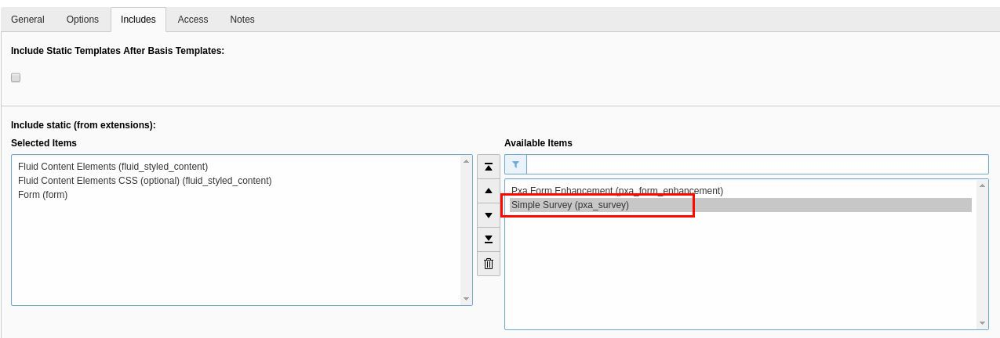

.. ==================================================
.. FOR YOUR INFORMATION
.. --------------------------------------------------
.. -*- coding: utf-8 -*- with BOM.

.. include:: ../Includes.txt

.. _admin-manual:

Administrator Manual
====================

Target group: **Administrators**

Describes how to manage the extension from an administrator point of view.
That relates to Page/User TSconfig, permissions, configuration etc.,
which administrator level users have access to.

.. _admin-installation:

Installation
------------

- Install the **Simple Survey** Extension in the Extension Manager
- Include the Template by selecting **Template** and the root of your site. Then click on **Edit the whole template record**
- In the Include tab select **Simple Survey (pxa_survey)** on the right side of the Include static (from extensions): selection box.

   Include static template