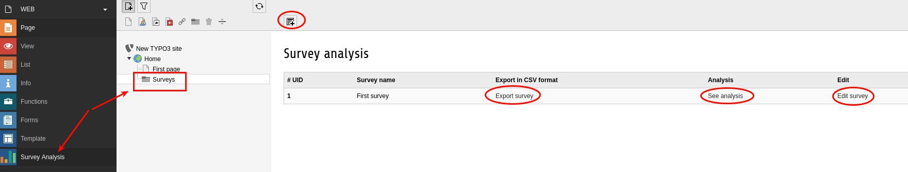

.. ==================================================
.. FOR YOUR INFORMATION
.. --------------------------------------------------
.. -*- coding: utf-8 -*- with BOM.

.. include:: ../Includes.txt

.. _backend-module-manual:

Backend module
====================

Extension provides simple and nice BE module to display survey result and export as CSV file.

.. _module-using:

Module
------------

- Find in "Web" section of BE **"Survey Analysis"** module
- Choose storage with survey records
- There are a few helpful buttons to create/edit survey
- Also you can see auto generated chart or export data in CSV format

   Backend module