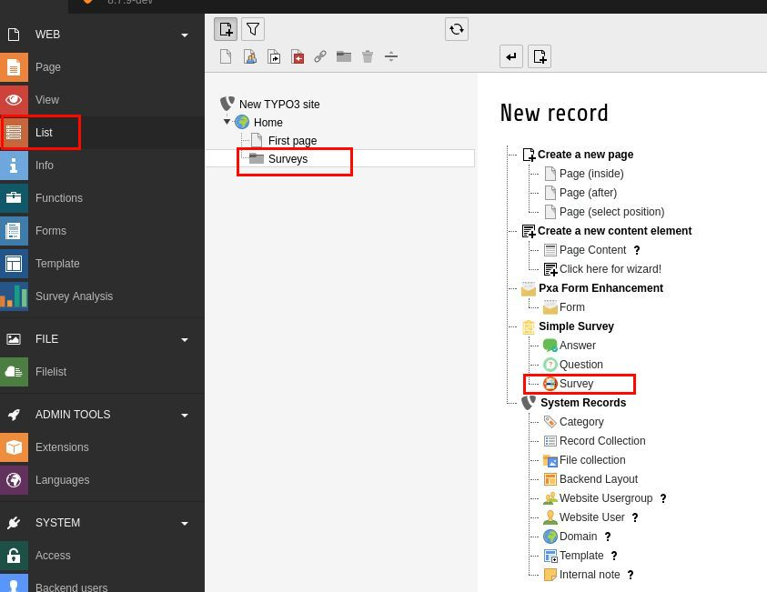
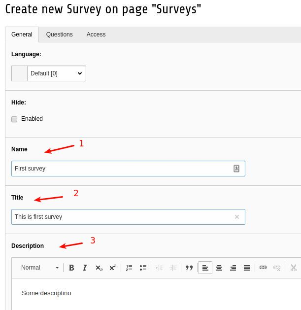
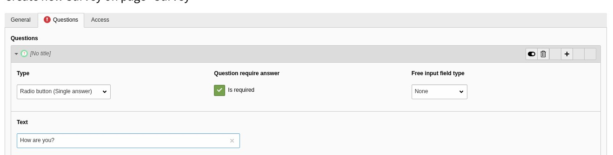

.. ==================================================
.. FOR YOUR INFORMATION
.. --------------------------------------------------
.. -*- coding: utf-8 -*- with BOM.

.. include:: ../../Includes.txt

.. important::
	It may be that not all options visible here in this documentation are also visible to every editor.

	The administrator may still choose to hide several options from an editor.

.. _editor-create-simple-survey:

Create simple survey
--------------------

Prepare storage with new record
^^^^^^^^^^^^^^^^^^^^^^^^^^^^^^^
- Create new folder
- Go to list module view
- Choose folder storage
- Create new **Survey**

   New survey in storage

Create survey record with questions and answers
^^^^^^^^^^^^^^^^^^^^^^^^^^^^^^^^^^^^^^^^^^^^^^^
- Fill in survey fields
- On "Questions" tab add questions
- Choose type

.. tip::
   Radio button. Use in case if user should choose only one option

   Checkboxes if multiple answer allowed

   Free input field for any text answer

- Create answers for each question

Field settings
^^^^^^^^^^^^^^

Survey fields
"""""""""""""

Name
      Name of survey
|
Title
      If title is set it'll replace the name on frontend view
|
Description
      Description of survey

   Survey fields

Question fields
"""""""""""""""

Type
      Each question has 3 options: *Radio button, Checkboxes, Input field*
|
Question is required to be answered.
      Check if question is required
|
Free input field type
      Select input or text area in order to add free field answer for user
|
Text
      Text of question

   Question fields

Answer fields
"""""""""""""""
Text
   Simple text answer

.. figure:: ../../Images/EditorManual/Selection_019.jpg
   :alt: answer_record

   Answer fields