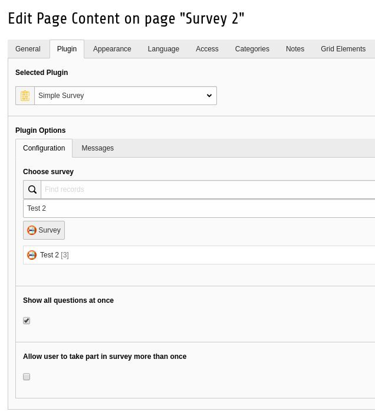

.. ==================================================
.. FOR YOUR INFORMATION
.. --------------------------------------------------
.. -*- coding: utf-8 -*- with BOM.

.. include:: ../Includes.txt

.. _editor-add-plugin:

Add plugin with survey on a page
------------

- Create a new Content Element **Plugins -> Simple survey**
- In plugin settings window **choose Survey from storage folder**
- It is possible to show all question at once or do survey step by step, depends on **Show all questions at once" checkbox**
- Enable or disable multiple participation in survey , depends on **Allow user to take part in survey more than once" checkbox**
- Enable or disable reCAPTCHA protection **Protect with reCAPTCHA**
- Enter custom message that is displayed after user has finished survey
- Enter custom message for user that has already finished survey

   Plugin