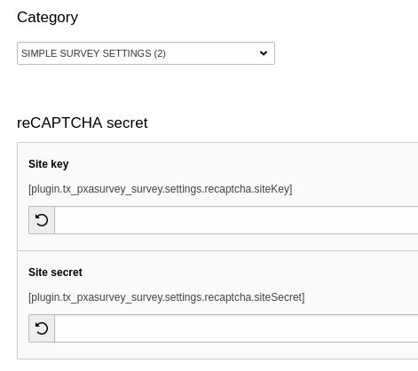

.. ==================================================
.. FOR YOUR INFORMATION
.. --------------------------------------------------
.. -*- coding: utf-8 -*- with BOM.

.. include:: ../Includes.txt

.. _editor-enable-recaptcha:

Enable reCAPTCHA
------------

Configure TypoScript constants
""""""""""""""""""""

Configure constants with site key and secret.
https://www.google.com/recaptcha/

.. code-block:: typoscript

  plugin.tx_pxasurvey_survey {
    settings {
      recaptcha {
        siteKey =
        siteSecret =
      }
    }
  }

   Editor

Protect survey with reCAPTCHA
""""""""""""""""""""

Don't forget to enable reCAPTCHA protection in plugin settings